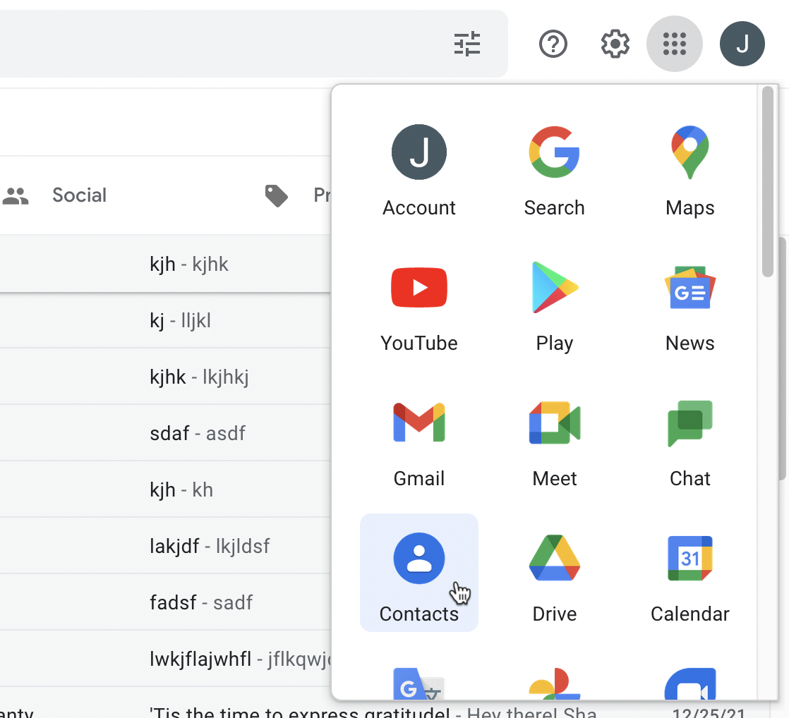

# Import senders

You can bulk import your favorite senders from Gmail. This gives you a boost when you start using the Screener, as you will not need to explicity allow these senders - they will land in your inbox from day one.

### Export your favorite contacts from Gmail

Visit Gmail and click the dots menu at the top right of the page. Click "Contacts".

When the contacts page loads, click "Frequently Contacted" on the left hand side:

Select one of the contacts and then you will see a dropdown select at the top of the page, click "All" to select all of the senders.

Click the three-dot menu and click "Export".

.png>)

A .csv file will be downloaded.&#x20;

### Import your favorite senders to the Screener

Visit the [Screener settings page here](https://leavemealone.app/app/mail/screener/settings).

Scroll down to the **Import Contacts** setting, click "Browse" and select your .csv file from the pervious step.

You will be shown the contact email addresses to import. Select the action that the Screener should take when it encounters these email addresses and select "Save".

.png>)

The senders will now show in the Screener View, under the relevant filter.
