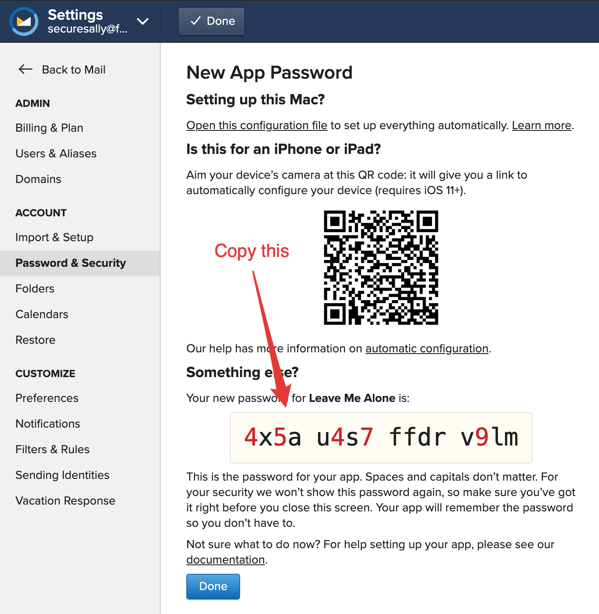

# How to connect a Fastmail account

.png>)

## Step 1: Generate an app password

1. Open the [Password & Security → App Passwords](https://www.fastmail.com/go/settings/security/devicekeys) screen.
2. Enter your password and click Unlock, then click **New App Password**.
3. Select **Custom...** name and enter "**Leave Me Alone**".
4. Select **Mail (IMAP/POP/SMTP)** access **** and click Generate Password.
5. **Copy the App Password** - don't forget this bit ️⚠️.


Don't forget to copy your app password after you click **Generate Password**!








.png>)

.png>)




All done!

You can now connect your Fastmail account to [Leave Me Alone](https://leavemealone.app) using your email address and the App Password you just generated.

## Troubleshooting

### Still need help?

Submit a request [here](https://leavemealone.app/feedback) or email us at [support@leavemealone.app](mailto:support@leavemealone.app).
