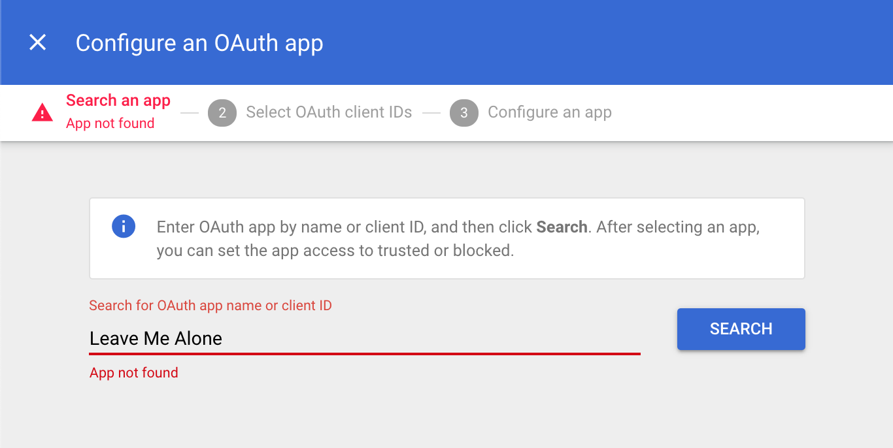

# Connecting a G Suite account


## Step 1: Manage app access control

1. Sign in to your [Google Admin Console](https://admin.google.com/) and go to **Security**.
2. Scroll to the bottom and click **API Controls**.
3. Under App access control click **MANAGE THIRD-PARTY APP ACCESS**.


## Step 2: Configure trusted apps


Make sure you use the right app name "**LeaveMeAlone**" ****without spaces!

Check the Client ID matches the one below.


```text
229643572503-d51b5c1infuudehgdlg1q0sigjella2h.apps.googleusercontent.com
```

1. Click **Configure new app** and select **OAuth App Name Or Client ID**.
2. Enter **LeaveMeAlone** \(_without spaces_\) and click **Search**.
3. Find **LeaveMeAlone** and click **Select**. \(You might see our old logo, it will update soon\).
4. **Check the box** to select the LeaveMeAlone Client ID and click **Select**.
5. Choose **Trusted: Can access all Google services** and click **Configure**.


## Troubleshooting

### Problem: App not found



### Solution: Use correct app name

Make sure the app name is correct and **without spaces** "LeaveMeAlone". Or you can use our Client ID to search.

```text
229643572503-d51b5c1infuudehgdlg1q0sigjella2h.apps.googleusercontent.com
```


