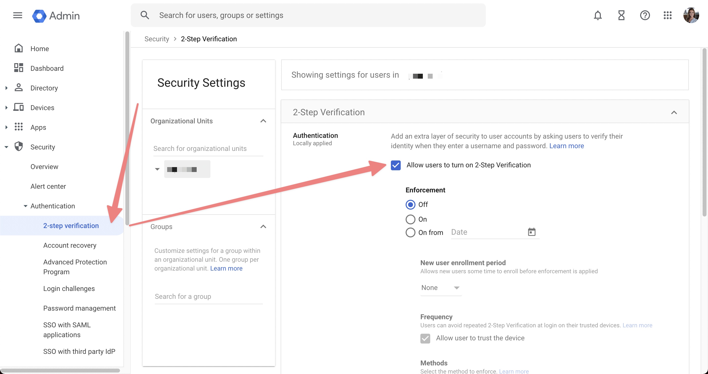

# How to connect a Gmail account

.png>)

## Step 1 : Enable IMAP

To scan your mailbox for emails, you need to enable IMAP for your Gmail account.

1. Go to your Gmail settings [Forwarding and POP/IMAP](https://mail.google.com/mail/#settings/fwdandpop) tab.
2. In the "IMAP access" section, select **Enable IMAP**.
3. Click **Save Changes** (don't forget this step ⚠️).











## Step 2 : Turn on 2-Step Verification


If you don't have 2-Step Verification enabled then the next step won't work!


1. Go to your [Google Account](https://myaccount.google.com/) **Security** **tab**.
2. On the _Signing in to Google_ panel, click [**2-Step Verification**](https://myaccount.google.com/signinoptions/two-step-verification).
3. Click **Get started** and follow the steps.











## Step 3 : Create an App Password

1. Go to your [Google Account](https://myaccount.google.com/) **Security tab** again.
2. On the _Signing in to Google_ panel, click [**App Passwords**](https://myaccount.google.com/apppasswords).
3. At the bottom, choose **Select app** and choose **Other **_**(Custom Name)**_.
4. Enter "**Leave Me Alone**" and choose **GENERATE**.
5. **Copy the App Password** (the 16-character code in the yellow bar on your device) - don't forget this bit ️⚠️.


Don't forget to copy your app password after you click **Generate**!












All done!

You can now connect your Gmail to [Leave Me Alone](https://leavemealone.app/) using your email address and the App Password you just generated.

## Troubleshooting

### The setting that you are looking for is not available for your account.

You must [enable 2-step verification](connecting-gmail.md#step-2-turn-on-2-step-verification) for the app password setting to be available for your Google account so please check you have done this first.

If you can't see the option to enable 2-step verification and you have a Google Workspace account please see the next section.

### There is no option to create an app password (Google Workspace)

If you are connecting a Google Workspace account and you don't see the option to create an app password you will need to contact your system administrator and ask them to enable access.

They can find it in **Security** -> **Access and data control** -> **Less secure apps** -> Select the option "_Allow users to manage their access to less secure apps_".

Once this has been done you should be able to follow this guide to create an app password and connect your account to Leave Me Alone.

<figure><figcaption>
Steps to allow users to manage their access to less secure apps in Google Workspace Admin dashboard
</figcaption></figure>

### There is no option to enable 2-step verification

If you are connecting a Google Workspace account and you don't see the option to enable 2FA then you will need to contact your system administrator and ask them to enable to the setting.

They can find it in **Security** -> **Authentication** -> **2-step verification** -> Check the box "_Allow users to turn on 2-Step Verification_"

### The password is incorrect for this account

Make sure that you're using the [app password generated in step 3](connecting-gmail.md#step-3-create-an-app-password) above.

​​If you still can’t connect your account, try the following:\
\
1\. On your device’s browser, go to [https://accounts.google.com/DisplayUnlockCaptcha](https://accounts.google.com/DisplayUnlockCaptcha).\
2\. Enter your username and password, then enter the letters on the screen.\
3\. Go back to Leave Me Alone and try connecting again.


Once you have completed the Display Unlock Captcha you have 10 minutes to connect your account.


### Still need help?

Submit a request [here](https://leavemealone.app/feedback) or email us at [support@leavemealone.app](mailto:support@leavemealone.app).
