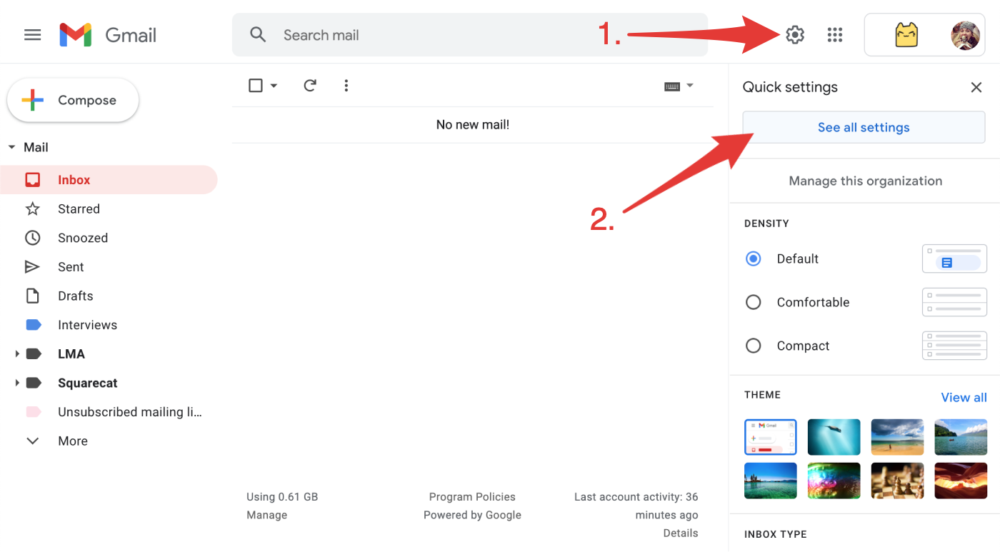

# Connecting a Gmail account

## Step 1 : Enable IMAP

To scan your mailbox for emails, you need to enable IMAP for your Gmail account.

1. Go to your Gmail settings [Forwarding and POP/IMAP](https://mail.google.com/mail/#settings/fwdandpop) tab.
2. In the "IMAP access" section, select **Enable IMAP**.
3. Click **Save Changes** \(don't forget this step ⚠️\).











## Step 2 : Turn on 2-Step Verification


If you don't have 2-Step Verification enabled then the next step won't work!


1. Go to your [Google Account](https://myaccount.google.com/) **Security** **tab**.
2. On the _Signing in to Google_ panel, click [**2-Step Verification**](https://myaccount.google.com/signinoptions/two-step-verification).
3. Click **Get started** and follow the steps.











## Step 3 : Create an App Password

1. Go to your [Google Account](https://myaccount.google.com/) **Security tab** again.
2. On the _Signing in to Google_ panel, click [**App Passwords**](https://myaccount.google.com/apppasswords).
3. At the bottom, choose **Select app** and choose **Other** _**\(Custom Name\)**_.
4. Enter "**Leave Me Alone**" and choose **GENERATE**.
5. **Copy the App Password** \(the 16-character code in the yellow bar on your device\) - don't forget this bit ️⚠️.


Don't forget to copy your app password after you click **Generate**!












All done!

You can now connect your Gmail to [Leave Me Alone](https://leavemealone.app/) using your email address and the App Password you just generated.

## Troubleshooting

### The setting that you are looking for is not available for your account.

You must [enable 2-step verification](connecting-gmail.md#step-2-turn-on-2-step-verification) for this setting to be available for your Google account.

### The password is incorrect for this account

Make sure that you're using the [app password generated in step 3](connecting-gmail.md#step-3-create-an-app-password) above.

​​If you still can’t connect your account, try the following:  
  
1. On your device’s browser, go to [https://accounts.google.com/DisplayUnlockCaptcha](https://accounts.google.com/DisplayUnlockCaptcha).  
2. Enter your username and password, then enter the letters on the screen.  
3. Go back to Leave Me Alone and try connecting again.


Once you have completed the Display Unlock Captcha you have 10 minutes to connect your account.


### Still need help?

Submit a request [here](https://leavemealone.app/feedback) or email us at [support@leavemealone.app](mailto:support@leavemealone.app).

