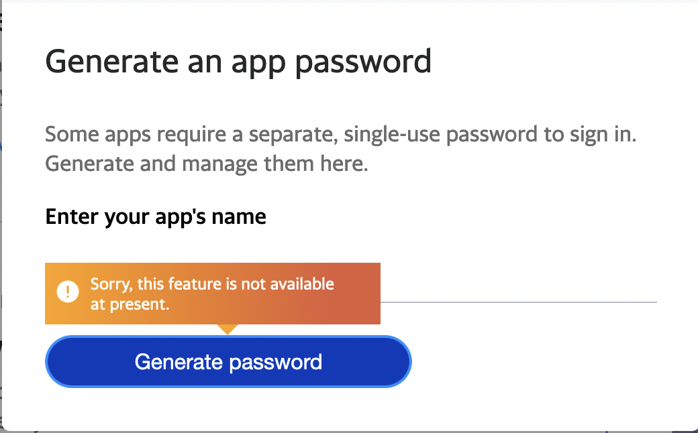

# Connecting an iCloud Mail account

## Step 1: Generate an app-specific password

1. [Sign in to your Apple ID account page](https://appleid.apple.com/account/home).
2. In the Security section, click **Generate Password...** below App-Specific Passwords.
3. Enter "**Leave Me Alone**" and click Create.
4. **Copy the App Password** - don't forget this bit ️⚠️


Don't forget to copy your app password after you click **Create**!


All done!

You can now connect your iCloud to [Leave Me Alone](https://leavemealone.app/) using your email address and the App Password you just generated.

## Troubleshooting

### Still need help?

Submit a request [here](https://leavemealone.app/feedback) or email us at [support@leavemealone.app](mailto:support@leavemealone.app).

