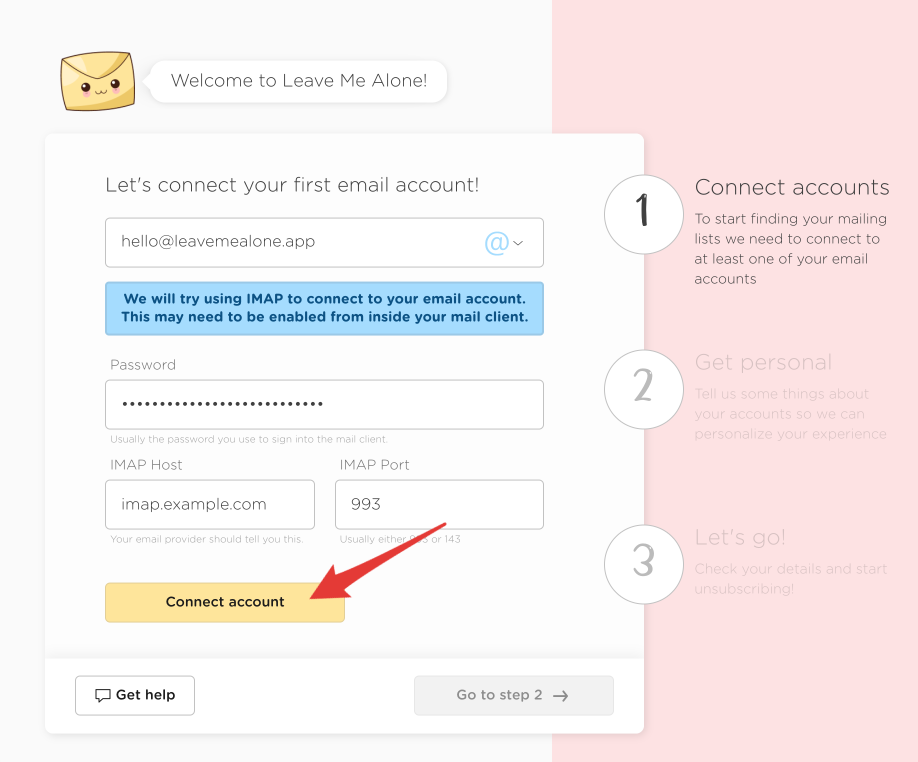

# How to connect any email account with IMAP

## Step 1: Find your IMAP details

IMAP is a way for Leave Me Alone to connect to your email account so that we can scan your mailboxes and show you emails to unsubscribe from.

You will need the **IMAP** **host** (or **IMAP Server**) and **IMAP** **port** for your mail provider's server.

You can usually find this by searching Google for "**\<your email account> IMAP settings**".

.png>)

## Step 2: Connect your account

1. Enter your email address and wait for us to select your account type (or you can click the dropdown on the right of the field to change the account type)
2. Enter your password (this is usually the password you use to sign in)
3. Enter the **IMAP host** and **IMAP port** you found in [Step 1](connecting-other-imap.md#step-1-find-your-imap-details)
4. Click **Connect account**











All done!

You can now connect your any email account that supports IMAP to [Leave Me Alone](https://leavemealone.app/) using this method.

## Troubleshooting

### Still need help?

Submit a request [here](https://leavemealone.app/feedback) or email us at [support@leavemealone.app](mailto:support@leavemealone.app).
