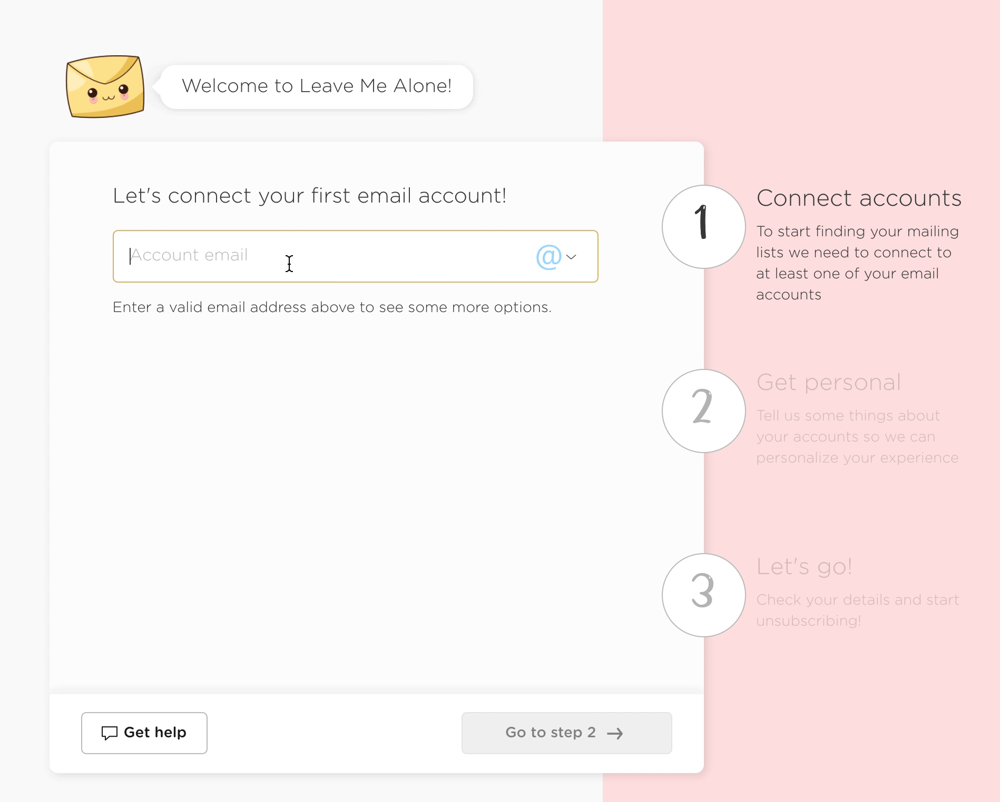
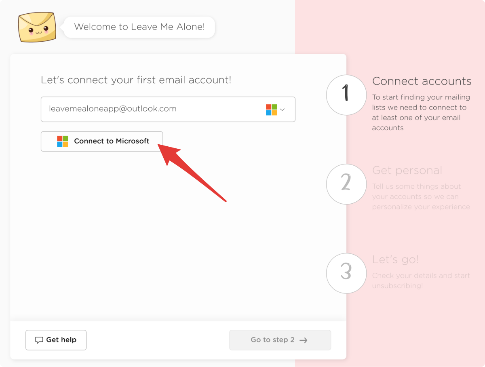
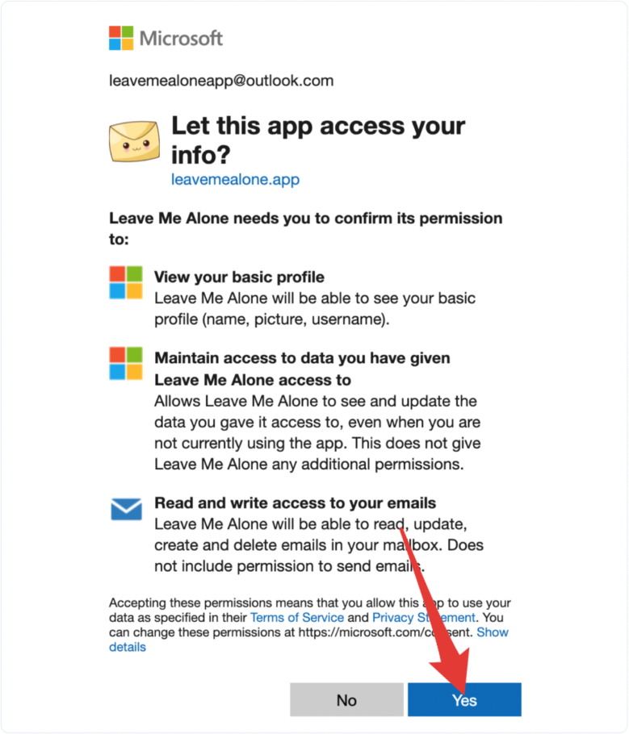

# Connecting an Outlook account

## Step 1: Sign in with Microsoft

1. Enter your email address and click **Connect to Microsoft**
2. Sign in to your email account \(if not already signed in\)
3. Review the permissions and click **Yes** to allow Leave Me Alone access to scan your emails











All done!

You can now connect your Microsoft Outlook account to [Leave Me Alone](https://leavemealone.app/) using your email address and the App Password you just generated.

## Troubleshooting

### Still need help?

Submit a request [here](https://leavemealone.app/feedback) or email us at [support@leavemealone.app](mailto:support@leavemealone.app).

