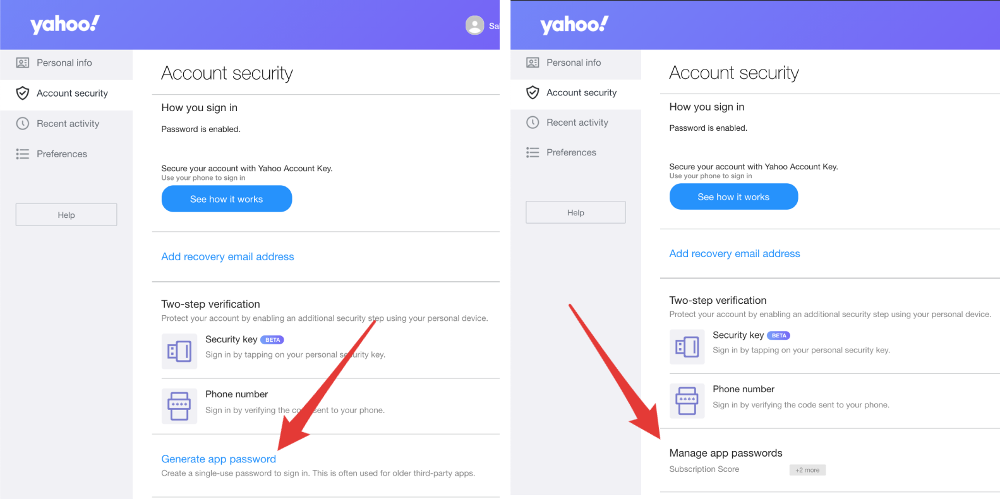
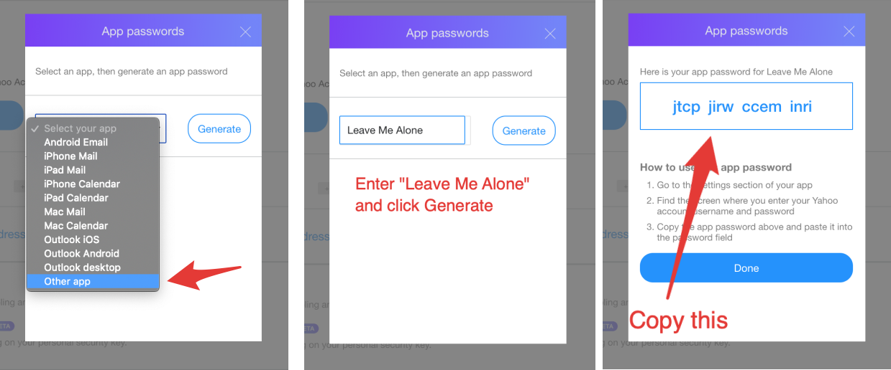

# How to connect a Yahoo Mail account

 (1).png>)

## Step 1: Generate an app password

1. [Sign in and go to your Account security page](https://login.yahoo.com/account/security).
2. Click **Generate app password**, or **Manage app passwords** if you already have app passwords for other services.
3. In the popup select "**Other app**"
4. Enter "**Leave Me Alone**" and click Generate.
5. **Copy the App Password** - don't forget this bit ️⚠️.


Don't forget to copy your app password after you click **Generate**!




.gif>)








All done!

You can now connect your Yahoo Mail to [Leave Me Alone](https://leavemealone.app/) using your email address and the App Password you just generated.

## Troubleshooting

### App Passwords unavailable

When you try to create an **app password** you might see this pop-up:

This means that unfortunately Yahoo has disabled the **app password** functionality for your account. Due to abuse of their system Yahoo will now only allow "trusted" accounts to use this functionality. In order to become a trusted account and re-enable app passwords you have to contact their support by email.

## Still need help?

Submit a request [here](https://leavemealone.app/feedback) or email us at [support@leavemealone.app](mailto:support@leavemealone.app).
