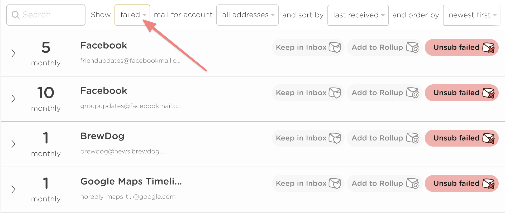
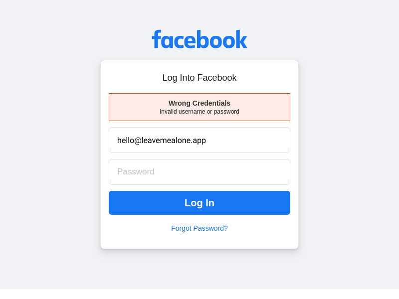
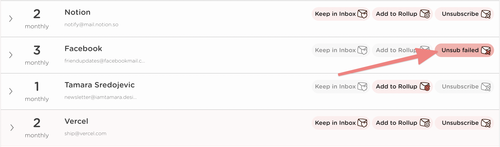

# Troubleshooting

## I'm not seeing any emails in Leave Me Alone

If you aren't seeing any subscriptions or you see the "no subscriptions here" message then your scan might be stuck.

This can usually be resolved by restarting the scan, and you can do this by visiting your [profile settings here](https://leavemealone.app/app/profile), scrolling to the bottom, and clicking the button "Restart scan".

Re-scanning will automatically take place but may take a few minutes to finish.

## I'm seeing a lot of failed unsubscribes

Sometimes when we try and unsubscribe you we might get a response that requires logging in or following extra steps.

If we reach a screen like this that we don't know how to deal with then we show you a notification (that maybe you might have missed). You can spot a failed unsubscribe in the mail list as it looks like this;

.png>)

If you click on those notifications then you can see how the unsubscribe failed, and easily fix it manually.\
\
You can also filter the mail list by '**failed**' to see all failed unsubscribes like this;

## I'm still getting emails from senders I unsubscribed from

Sometimes this can happen on the occasions where we failed to unsubscribe you.

For example when we try and unsubscribe you we might sometimes get a response like this, which requires further input.

If we reach a screen like this that we don't know how to deal with then we show you a notification (that maybe you might have missed). You can spot a failed unsubscribe in the mail list as it looks like this;

If you click on those notifications then you can see how the unsubscribe failed, and easily fix it manually.

If you don't think this is right then it's also possible that the mailing list we unsubscribed you from is not following the rules correctly and even though you have unsubscribed they are still sending you emails.

## Some emails in my Inbox are missing in Leave Me Alone


See also: [I'm not seeing any emails in Leave Me Alone](troubleshooting.md#im-not-seeing-any-emails-in-leave-me-alone)


Sometimes we might not identify a subscription email in your inbox and it won't show up in the Leave Me Alone mail list.

The best way for us to investigate why we're missing some of your subscriptions is to add 1-2 of the emails we aren't finding to [this form](https://airtable.com/shr6CwAxYzpcSURM4). We'll figure out what's happening and let you know when we find a solution.

## I can't use Rollups or Shield with my Google Workspace or Google Sign-in account

For Rollups and Shield to work correctly we need to watch your Inbox for incoming mail. If you have an account connected to Leave Me Alone with Google Sign-in then sadly Google doesn't allow us to do this.

This is a limitation from Google and unfortunately it's out of our control. However, you can still use Leave Me Alone to it's full potential if you connect your account using IMAP instead!

Please refer to this help page with instructions on how to do this;


[connecting-gmail.md](../guides/connecting-gmail.md)


If you would like us to help you make the switch then please contact us and we'll be happy to help!\
