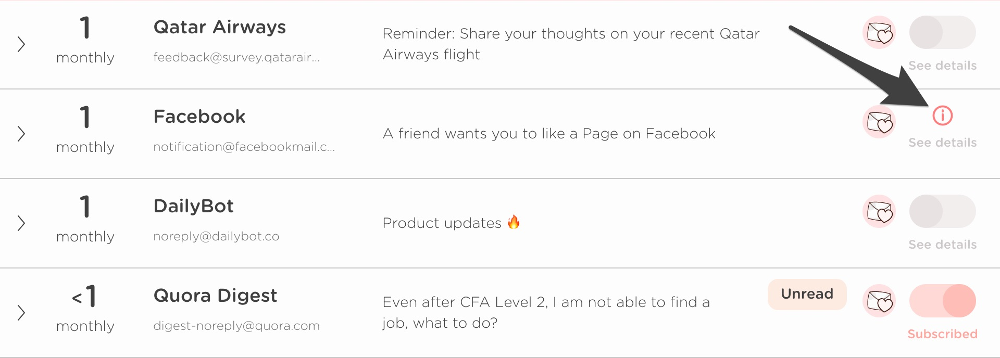

# Troubleshooting

## I'm not seeing any emails in Leave Me Alone

Sometimes the scan can get stuck. This can usually be resolved by restarting the scan, you can do this by visiting your [profile settings here](https://leavemealone.app/app/profile), scrolling to the bottom, and clicking the button "Clear Local Emails". Now when you go back to the mail list page it should restart the scan and hopefully it work this time!

## I'm still getting emails from senders I unsubscribed from

Sometimes this can happen on the occasions where we failed to unsubscribe you.

For example when we try and unsubscribe you we might sometimes get a response like this, which requires further input. We try and account for these, but they are constantly changing so sometimes we require your manual input.

If we reach a screen like this that we don't know how to deal with then we show you a notification \(that maybe you might have missed\). It looks like this;

If you click on those notifications then you can see how the unsubscribe failed, and easily fix it manually. **You are not charged any credits when this happens.**  
  
If you don't think this is right then it's also possible that the mailing list we unsubscribed you from is not following the rules correctly and even though you have unsubscribed they are still sending you emails.

