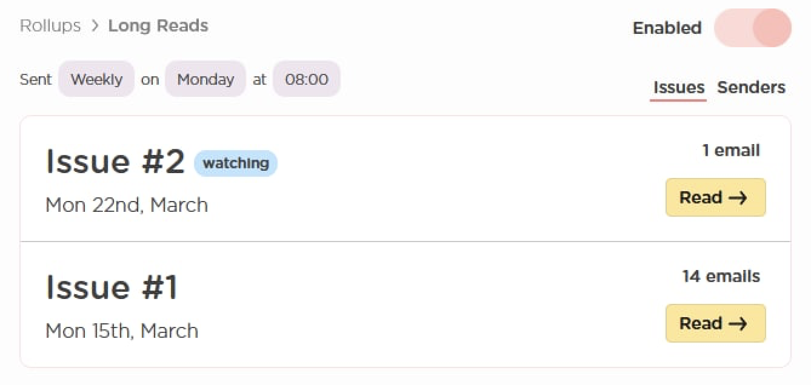

# How to add an email to your Rollup

[Rollups](https://leavemealone.app/rollups) are personalized collections of your favorite newsletters, sent as a single email. To add an email to your Rollup and receive it in your digest simply click the Rollup button in the mail list.

## How does Rollups work?

Every email you add to a Rollup will be collected into one email that's delivered when you decide.

Your first Rollup will be sent every day at 8am. If this doesn't suit you then you can change it - you're in charge!


Did you know you can receive multiple Rollups? Create Rollups for anything you like and keep your inbox ultra organised!


## What is an issue?

Your Rollup is like a magazine or newspaper. Each time we send your Rollup we're sending you the next issue in your regular series of digest emails.

When you create your Rollup we automatically create the first issue for you \(Issue \#1\). When you receive an issue the next one will be automatically created \(Issue \#2, Issue \#3 etc\). This provides a way for you to see and read the previous Rollups you have received easily!

