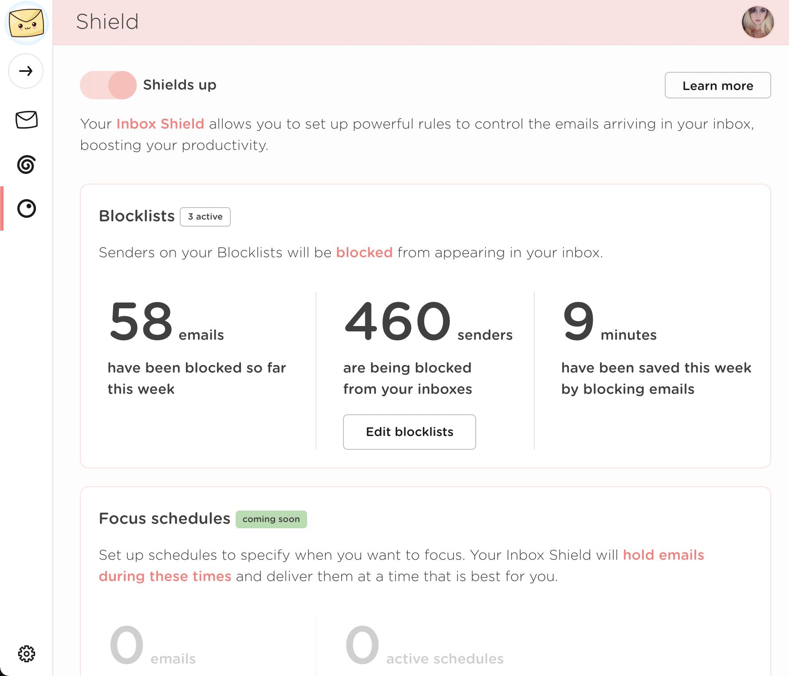

# How to block emails from your inbox

Leave Me Alone can block annoying emails from landing in your inbox! To start blocking emails [Enable Inbox Shield](../usage/shield.md) and configure your [Blocklists](../usage/blocklists/).

Please refer to these guides for more information:


[shield.md](../usage/shield.md)



[blocklists](../usage/blocklists/)

