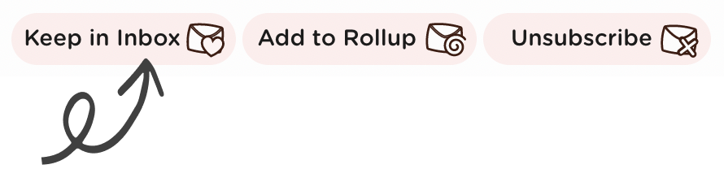

# How to keep an email in your inbox

If you don't want to unsubscribe or roll-up an email then you can keep a subscription in your inbox by clicking the **Keep In Inbox** button on the mail list.

Emails from this sender will continue to land in your inbox. You can always change your mind and unsubscribe or add to a Rollup later!

