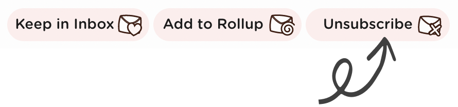

# How to unsubscribe from an email

Once you've connected your accounts you'll start to see your subscription emails in Leave Me Alone. If you didn't connect any accounts yet then do [go here](how-to-connect-your-email-account.md) and that first!

To unsubscribe from the emails you don't want just click the unsubscribe button and we will do the hard work for you!

### Where are my unsubscribed emails?

You can find unsubscribed emails in the **unsubscribed** filter on the mail list.

## Having problems?





