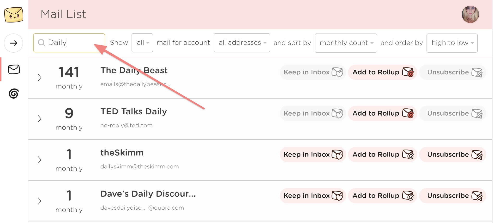
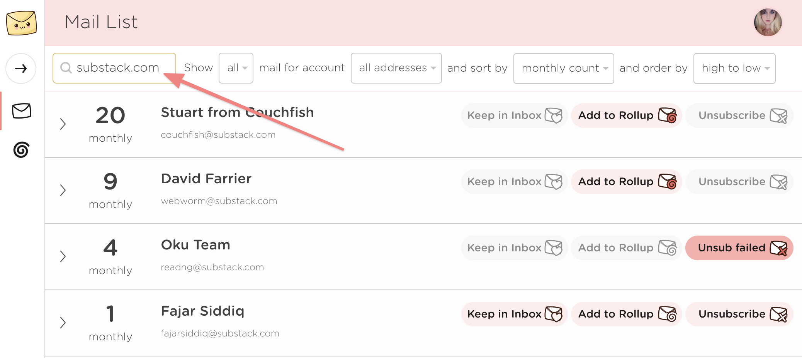
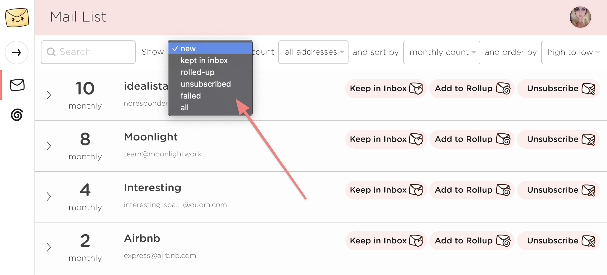
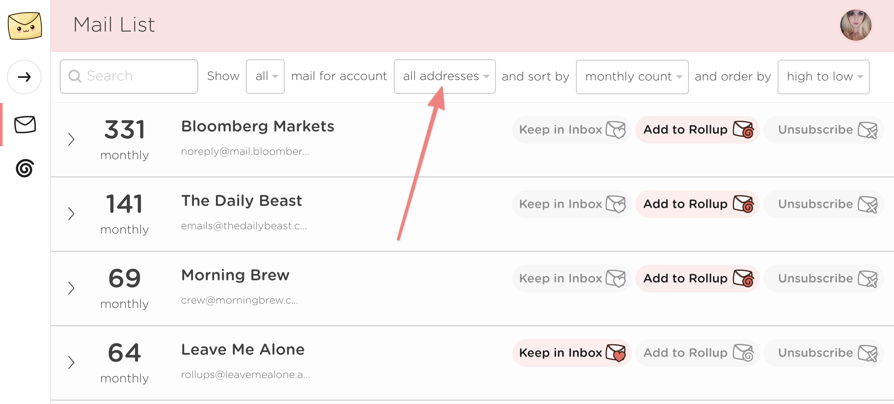
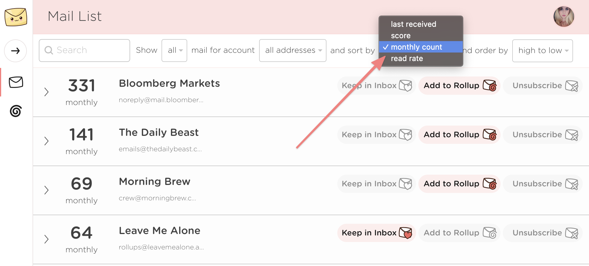

# How to search, sort, and filter your mail

## How can I search for emails?

You can search the Mail List for a specific sender by their name or their email address. Simply start typing in the search box and the results will be shown below.

To clear the search just clear the search text.

## How can I see unsubscribed, failed, or rolled-up emails?

You can change the **show** dropdown to filter the Mail List by type. By default we show you **new** mail which is mail you haven't decided to keep, rollup, or unsubscribe from yet.

The options are;

* **Kept in inbox** - all emails you selected to keep
* **Rolled-up** - all emails in any of your Rollups
* **Unsubscribed** - any emails we have successfully unsubscribed from
* **Failed** - any emails we failed to unsubscribe from \(you can see more information and details on how to unsubscribe manually from here too\)
* **All** - all of the above

## How can I see emails for just one of my accounts?

You can change the **account** dropdown to filter the Mail List by email address. All connected accounts will show up here and you can go through your mail per-account if you'd like.

## How can I see my most recent or most read emails?

You can change the **sort by** dropdown to change the order of the Mail List. You can change the direction of each option by using the **order by** dropdown alongside.

The options are;

* **Last received** - sorted by date, most recent first
* **Score** - sorted by our unique ranking system, best first
* **Monthly count** - sorted by the number of emails from a sender, highest first
* **Read rate** - sorted by how often you read emails from a sender, most first

