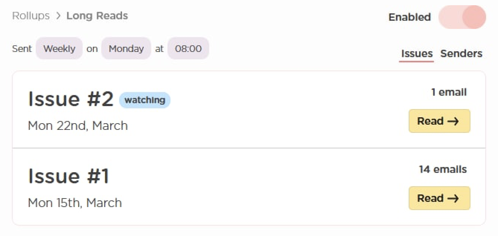

# Rollups

Do you receive newsletters that you love to receive but that are always lost in the noise of your inbox or you never have time to read your favorite emails when they arrive because you're busy or distracted?

Then Rollups is for you!

## What is a Rollup?

Rollups are personalized collections of your favorite newsletters, sent as a single email.

When you’re done unsubscribing, click the Rollup icon to combine the emails you love to read into a beautiful weekly digest.

## How does Rollups work?

Rollups is super simple!

When you create a Rollup we automatically create the first issue and are ready to start watching.

When you add a senders email address we'll watch your mailboxes for emails that come from that sender and move them out of your inbox so they don't distract you.

When it's your chosen day and time we'll send you an email with all the mail you received in your Rollup in the past week!

## What is an issue?

Your Rollup is like a magazine or newspaper. Each time we send your Rollup we're sending you the next issue in your regular series of weekly digest emails.

When you create your Rollup we automatically create the first issue for you \(Issue \#1\). When you receive an issue the next one will be automatically created \(Issue \#2, Issue \#3 etc\). This provides a way for you to see and read the previous Rollups you have received easily!

## Next steps:

Learn more about Rollups and how they work in our [Get started](learn-more.md) article:



Having problems? Check out our common troubleshooting articles:



