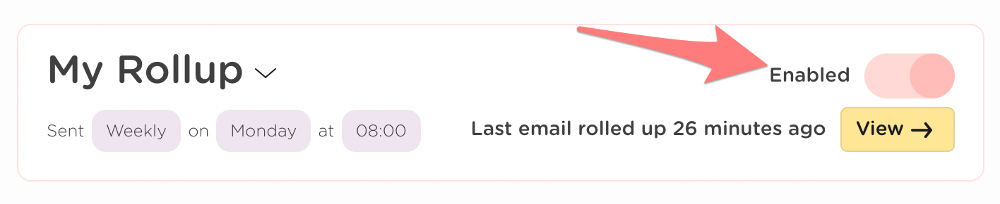
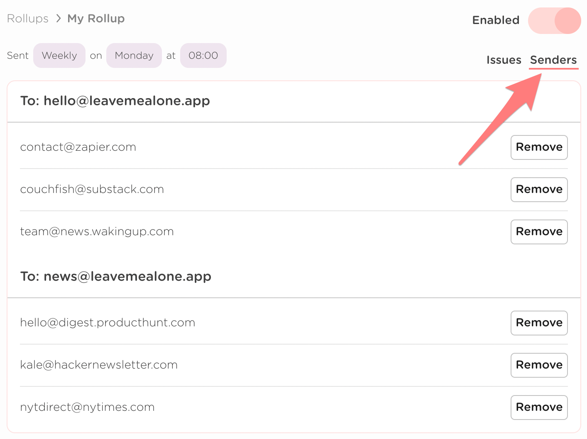

# How to create and use Rollups

Do you receive newsletters that you love to receive but that are always lost in the noise of your inbox or you never have time to read your favorite emails when they arrive because you're busy or distracted?

Then Rollups is for you!

## How can I create a Rollup?

You can create a new Rollup from the [Rollups page](https://leavemealone.app/app/rollups) and clicking **Create New Rollup**.

## How often can I receive my Rollup?

You can choose to receive your Rollup daily or weekly and you choose the day and time.


Daily Rollups are only available on our **Inbox Zero Hero** plan ✨


## Can I change when I receive my Rollup?

Yes! You can edit your Rollup schedule by clicking the chevron icon and clicking Edit.


We recommend you don't do this very often.


## Can I change how my Rollup looks?

Yes! If you are on our Hero plan then you can select from 3 different layout options depending on your needs;

**Featured view** - image previews from your most read senders  
**Detailed view** - subject lines for every email for more info  
**Compact view** - overview of total emails for quick viewing

Here's an example of the same Rollup in the different layout options;


**If you change a Rollups layout it will only affect the current watching issue and future issues. It will not change the layout of issues you have already recieved.**


### **Featured view**

### **Detailed view**

### **Compact view**

## Can I pause or deactivate a Rollup?

You can disable a Rollup at any time by clicking the toggle from the Rollups list or on the Rollup page. We will pause watching your mailboxes for the senders in that Rollup and you won't receive any more digest emails until you enable it again.

**What happens when you disable your Rollup:**

1. All previously rolled up emails will stay in your "\_lma-rollups" folder.
2. Future emails from senders in that Rollup will not be watched or moved out of your inbox.
3. You won't receive any more digest emails for that Rollup.
4. You can re-enable your Rollup at at any time.


Disabled Rollups do not count towards your monthly plan limits!


## How many senders can I add to a Rollup?

As many as you like!

## How can I see which emails are being Rolled up?

You can see the emails you've added to a Rollup by clicking on **Senders** in the navigation on the right. You can also remove senders from being Rolled up here if you wish.


Remember that when you remove a sender all emails for that sender will be removed from your current and previous Rollup issues.


You can tell which emails are in a Rollup from the Mail List by filtering by rolled-up:

## Can I manually add a sender to a Rollup?

Yes you can! You can add any sender to a Rollup using the 'Add sender manually' button from the senders list for your Rollup.


The **to address** of the email can only be one of your connected accounts


## How can I remove a sender from a Rollup?

You can remove a sender one of 2 ways:

1. Click the Rollup button on the mail list.
2. Navigate to the senders list for a Rollup and click the remove button.

## Can I still see rolled up emails in my mailbox?

Yes you can still see the emails in the **\_lma-rollups** folder in your email client. These emails will always be in your client even if you disable or delete a Rollup or deactivate your Leave Me Alone account.

## Can I delete emails in my Rollup?

You cannot delete emails from your Rollup in Leave Me Alone, but you can delete the emails in the **\_lma-rollups** folder in your email client.


Deleting an email from the Rollups folder does not unsubscribe you or stop that sender from being rolled up. If you want to stop an email being part of your Rollup you can follow the steps to remove a sender [here](./#how-can-i-remove-a-sender-from-a-rollup).


## How can I delete my Rollup?


**WARNING:** This is permanent and cannot be undone!


You can delete your Rollup from the Rollups page [here](https://leavemealone.app/app/rollups). Click the chevron and click the delete option.

* You won't be able to read this Rollup in Leave Me Alone any more.
* We will stop watching for emails from senders in this Rollup.
* We won't move emails in this Rollup out of your Inbox any more.

## Having problems?

Having problems? Check out our common troubleshooting articles:



