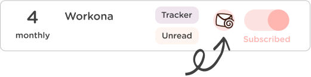
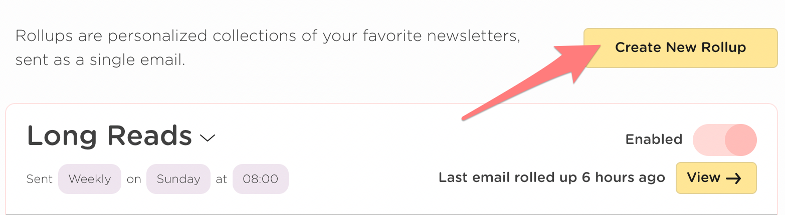
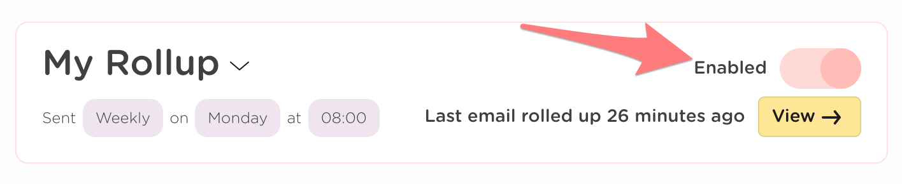
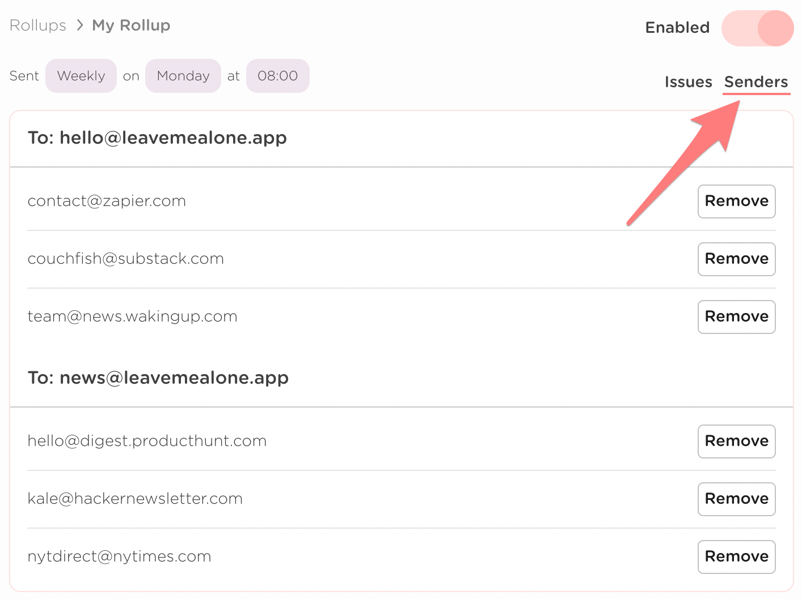
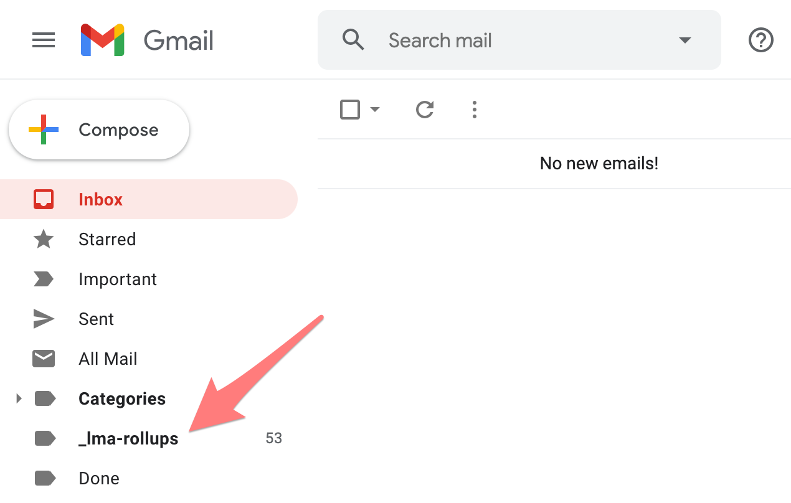

# Get started

## How can I create a Rollup?

You can create a new Rollup by clicking on the Rollup icon on the mail list and clicking **+ Create New Rollup.**

Or going to the [Rollups page](https://leavemealone.app/app/rollups) and clicking **Create New Rollup**.

## How often can I receive my Rollup?

You'll receive your Rollup digest email once per week, and you chose the day and time.

We plan to add more flexible scheduling in the future, please let us know if you'd be interested in this.

## Can I change when I receive my Rollup?

Yes! You can edit your Rollup schedule by clicking the chevron icon and clicking Edit.


We recommend you don't do this very often.


## Can I pause or deactivate a Rollup?

You can disable a Rollup at any time by clicking the toggle from the Rollups list or on the Rollup page. We will pause watching your mailboxes for the senders in that Rollup and you won't receive any more digest emails until you enable it again.

**What happens when you disable your Rollup:**

1. All previously rolled up emails will stay in your "\_lma-rollups" folder.
2. Future emails from senders in that Rollup will not be watched or moved out of your inbox.
3. You won't receive any more weekly digest emails for that Rollup.
4. You can re-enable your Rollup at at any time.


Disabled Rollups do not count towards your monthly plan limits!


## How many senders can I add to a Rollup?

As many as you like!

## How can I see which emails are being Rolled up?

You can see the emails you've added to a Rollup by clicking on **Senders** in the navigation on the right. You can also remove senders from being Rolled up here if you wish.


Remember that when you remove a sender all emails for that sender will be removed from your current and previous Rollup issues.


You can tell which emails are in a Rollup from the Mail List by the filled in Rollup icon: 

## Can I manually add a sender to a Rollup?

Not right now. The only way to add a sender to a Rollup is by using the Rollup button on the Mail List.

## How can I remove a sender from a Rollup?

You can remove a sender one of 2 ways:

1. Click the Rollup icon on the mail list and uncheck the Rollup.
2. Navigate to the senders list for a Rollup and click the remove button.

## Can I delete emails in my Rollup?

You cannot delete emails from your Rollup in Leave Me Alone, but you can delete the emails in the **\_lma-rollups** folder in your email client.


Deleting an email from the Rollups folder does not unsubscribe you or stop that sender from being rolled up. If you want to stop an email being part of your Rollup you can follow the steps to remove a sender [here](get-started.md#how-can-i-remove-a-sender-from-a-rollup).


## How can I delete my Rollup?


**WARNING:** This is permanent and cannot be undone!


You can delete your Rollup from the Rollups page [here](https://leavemealone.app/app/rollups). Click the chevron and click the delete option.

* You won't be able to read this Rollup in Leave Me Alone any more.
* We will stop watching for emails from senders in this Rollup.
* We won't move emails in this Rollup out of your Inbox any more.

