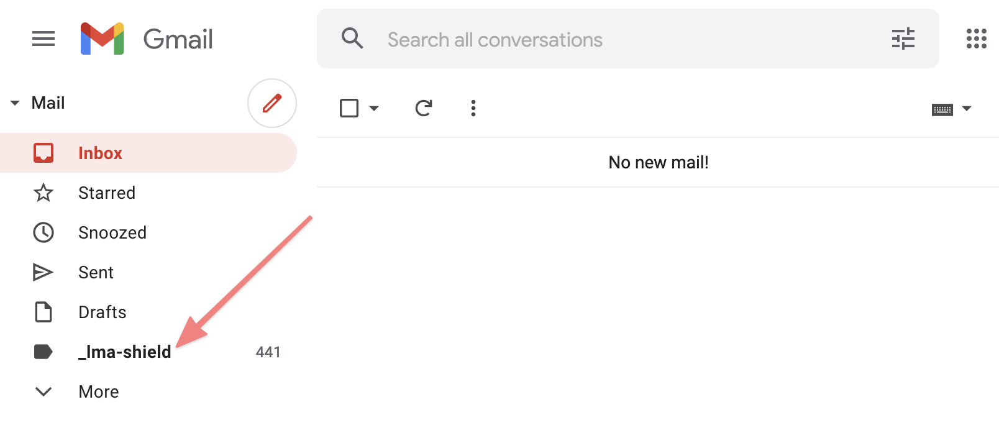

# How to use Inbox Shield

Inbox Shield is a way to reduce the number of emails that are hitting your inbox so that you can lower distractions and be more productive.

## How does Inbox Shield work?

When you **enable Shield** we'll start monitoring your inbox for new emails. If a new email matches a sender on one of your **Shield Blocklists**, then we move it instantly to a hidden folder so that it skips your inbox.

## How do I enable Inbox Shield?

Visit the [Shield Dashboard](https://leavemealone.app/app/shield) and click the "Shields Up" toggle.

.png>)

## Can I still see blocked emails in my mailbox?

Yes you can still see the emails in the **\_lma-shield** folder in your email client. These emails will always be in your mail client even if you disable Shields or deactivate your Leave Me Alone account.

## What happens to my blocklists if I disable Shield or deactivate my account?

If you disable Shield we immediately stop monitoring your inbox and stop blocking any emails. You can still edit your Blocklists but they will be inactive until you enable Shield again.

If you deactivate your Leave Me Alone account we immediately stop monitoring your inbox and **delete all of your account data including all of your Blocklists.**

