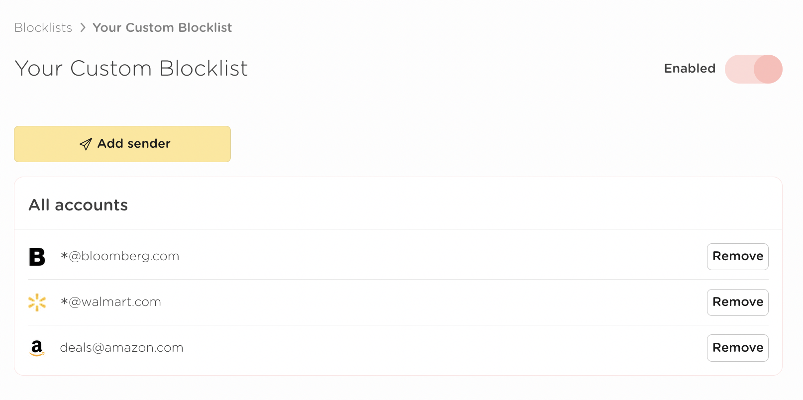

# The Custom Blocklist

The Custom Blocklist is for any senders you want to block that aren't in other blocklists. You can add any emails or domain you like to this blocklist and they will be screened out of your inbox!

Emails that have been screened because of this blocklist can be seen from The Screener mail view, and will have the "blocked" filter applied.

These emails will **not** be sent to you for review as a part of your Screener Digest.

