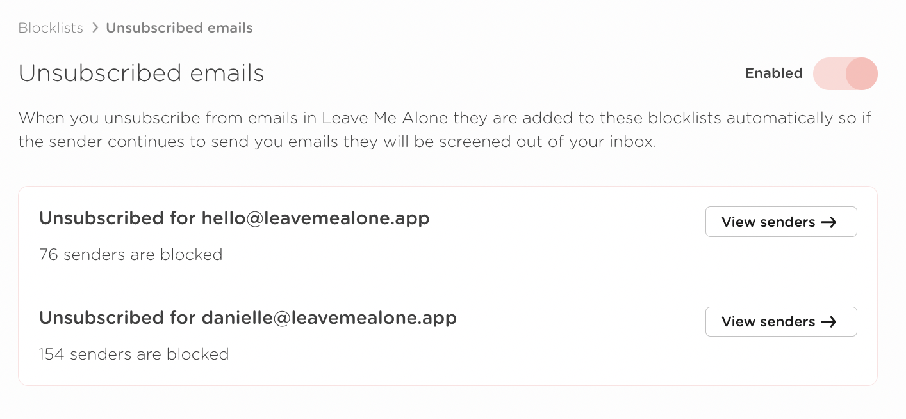

# The Unsubscribe Blocklist

When you unsubscribe from an email in Leave Me Alone the sender will be automatically added to an "Unsubscribe Blocklist". This means that even if the unsubscribe fails, you will no longer receive emails from that sender if you have Shield enabled.

You will have an Unsubscribe Blocklist for each of your connected accounts.

